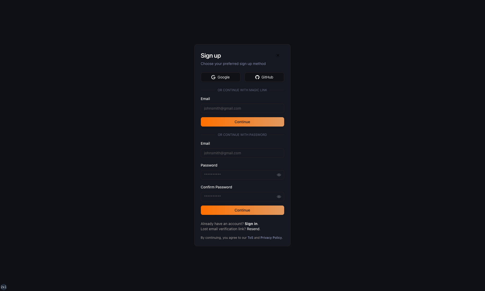

# AI-OVERFLOW

Modern, AI-powered, community-driven Stack Overflow alternative for developers. Get help, share knowledge, and collaborate with developers from around the world. Explore topics in web dev, mobile app development, algorithms, data structures, and more. Built with Next 14, Next-Auth, Prisma 5, Postgres @ Neon, TailwindCSS, ShadCn-UI, Lexical, and more.

**Work in progress**

